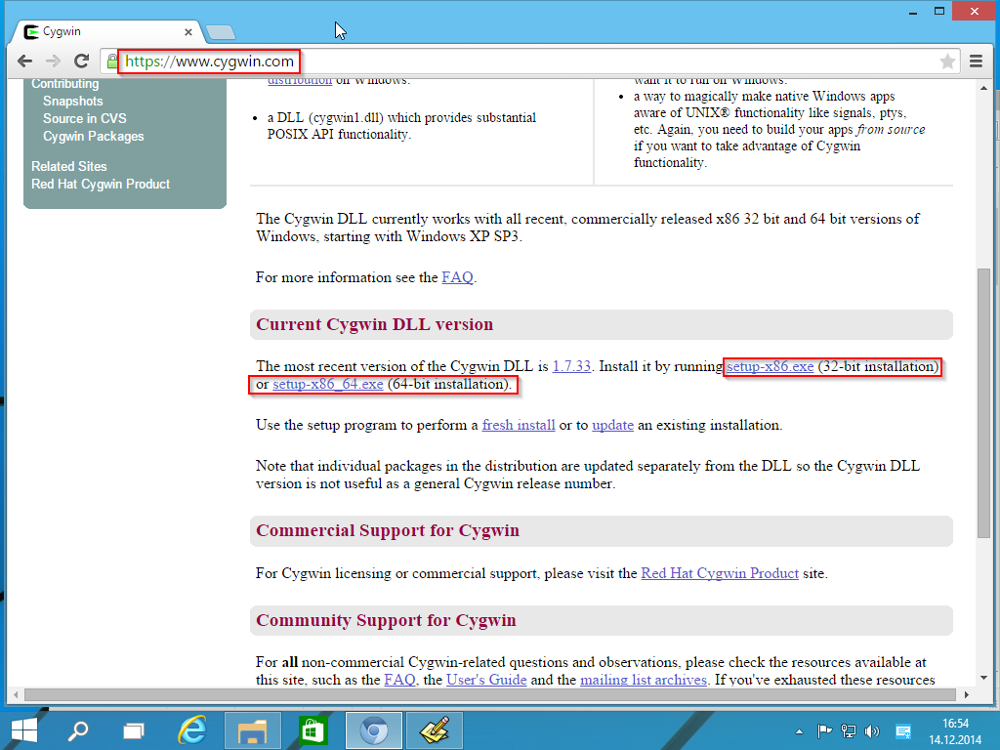
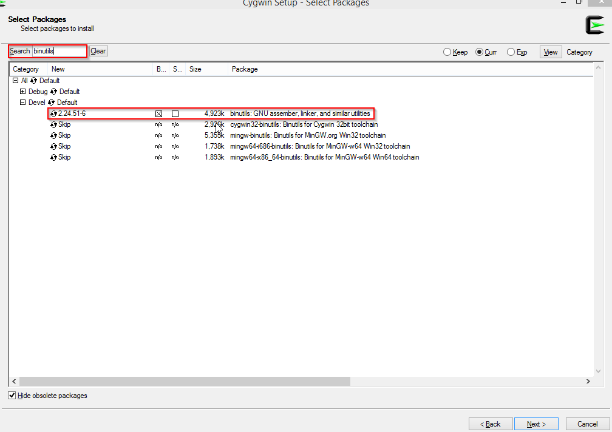
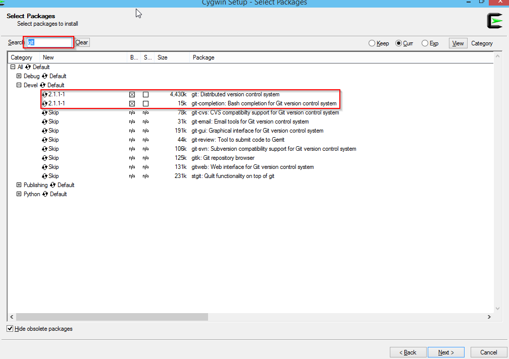
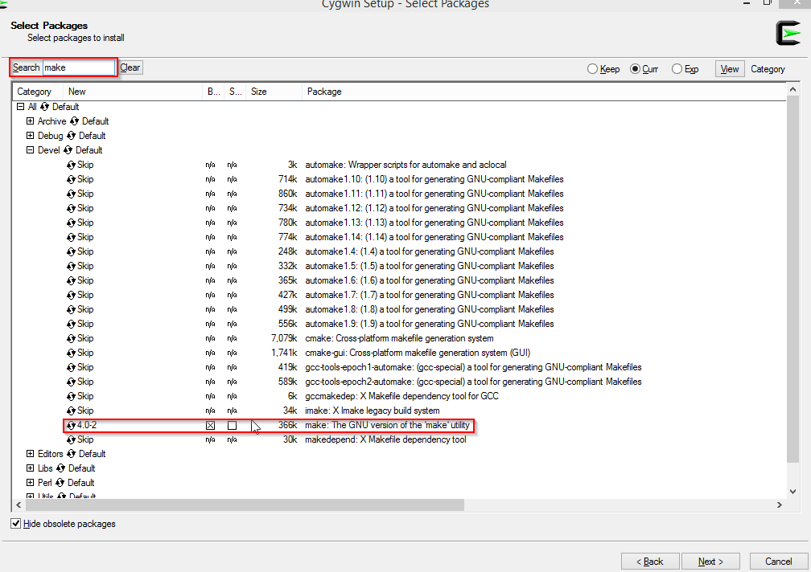
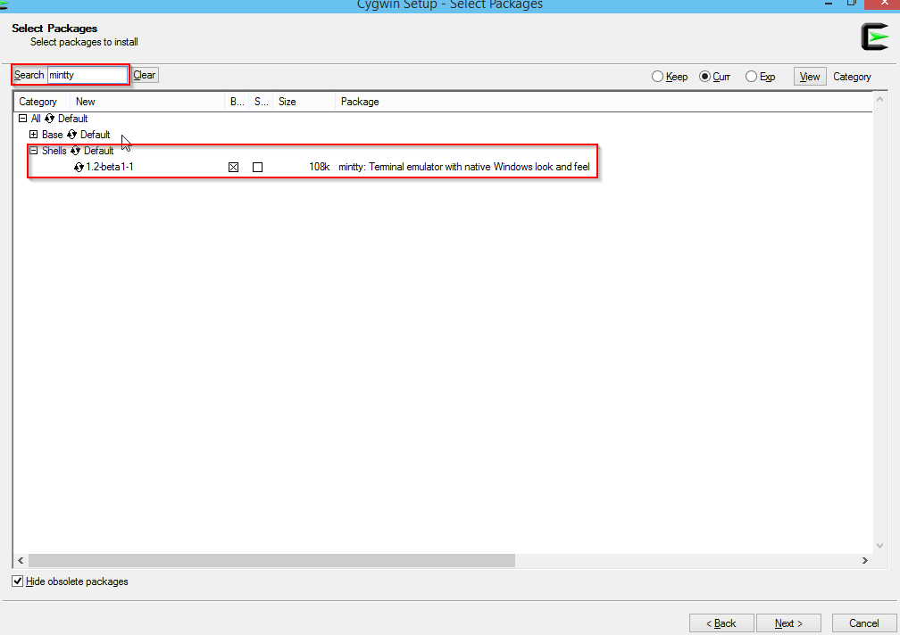
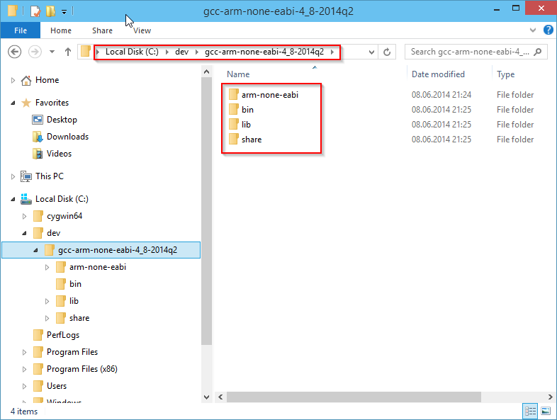
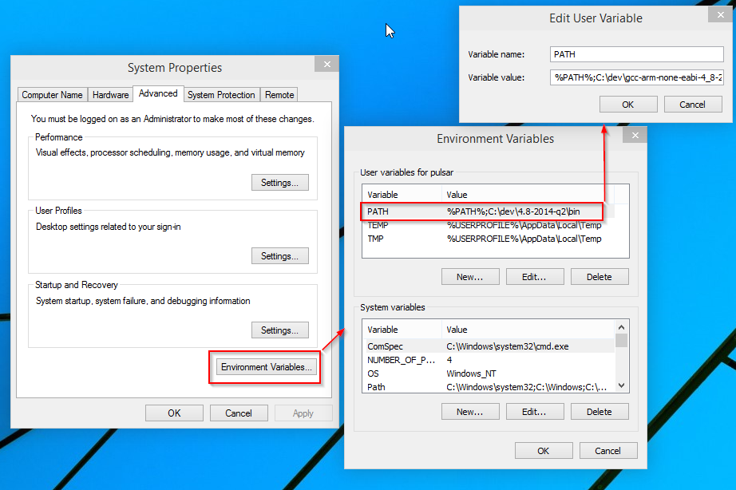
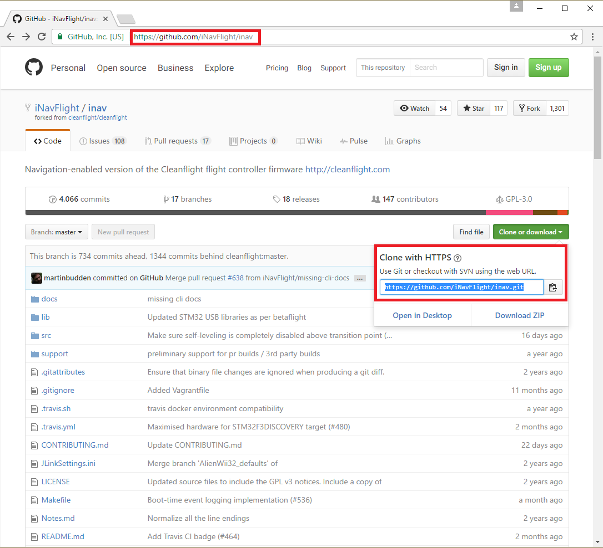
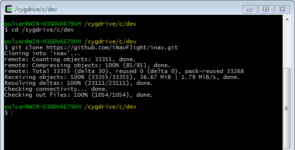
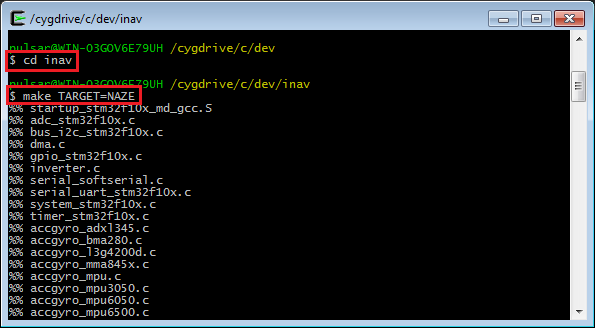

# Building in windows


##Setup Cygwin

download the Setup*.exe from https://www.cygwin.com/



Execute the download Setup and step through the installation  wizard (no need to customize the settings here). Stop at the  "Select Packages" Screen and select the following Packages
for Installation:

- Devel/binutils
- Devel/git
- Devel/git-completion (Optional)
- Devel/make
- Editors/vim	 
- Editors/vim-common (Optional)
- Shells/mintty (should be already selected)











Continue with the Installation and accept all autodetected dependencies.


##Setup GNU ARM Toolchain

----------

use the latest version available. Download this version from https://gcc.gnu.org/mirrors.html - preferably as a ZIP-File.


Extract the contents of this archive to any folder of your choice, for instance ```C:\dev\gcc-arm-none-eabi-*version number*```.



add the "bin" subdirectory to the PATH Windows environment variable: ```%PATH%;C:\dev\gcc-arm-none-eabi-*version number*\bin```




##Setup Ruby

Install the latest Ruby version using [Ruby Installer](https://rubyinstaller.org).

## Checkout and compile INAV

Head over to the INAV Github page and grab the URL of the GIT Repository: "https://github.com/iNavFlight/inav.git"

Open the Cygwin-Terminal, navigate to your development folder and use the git commandline to checkout the repository:

```bash
cd /cygdrive/c/dev
git clone https://github.com/iNavFlight/inav.git
```




To compile your INAV binaries, enter the inav directory and build the project using the make command. You can append TARGET=[HARDWARE] if you want to build anything other than the default SPRACINGF3 target:

```bash
cd inav
make TARGET=SPRACINGF3
```



within few moments you should have your binary ready:

```bash
(...)
arm-none-eabi-size ./obj/main/inav_SPRACINGF3.elf
   text    data     bss     dec     hex filename
  95388     308   10980  106676   1a0b4 ./obj/main/inav_SPRACINGF3.elf
arm-none-eabi-objcopy -O ihex --set-start 0x8000000 obj/main/inav_SPRACINGF3.elf obj/inav_SPRACINGF3.hex
```

You can use the INAV-Configurator to flash the ```obj/inav_SPRACINGF3.hex``` file.

## Updating and rebuilding

Navigate to the local INAV repository and use the following steps to pull the latest changes and rebuild your version of INAV:

```bash
cd /cygdrive/c/dev/inav
git reset --hard
git pull
make clean
make TARGET=SPRACINGF3
```
